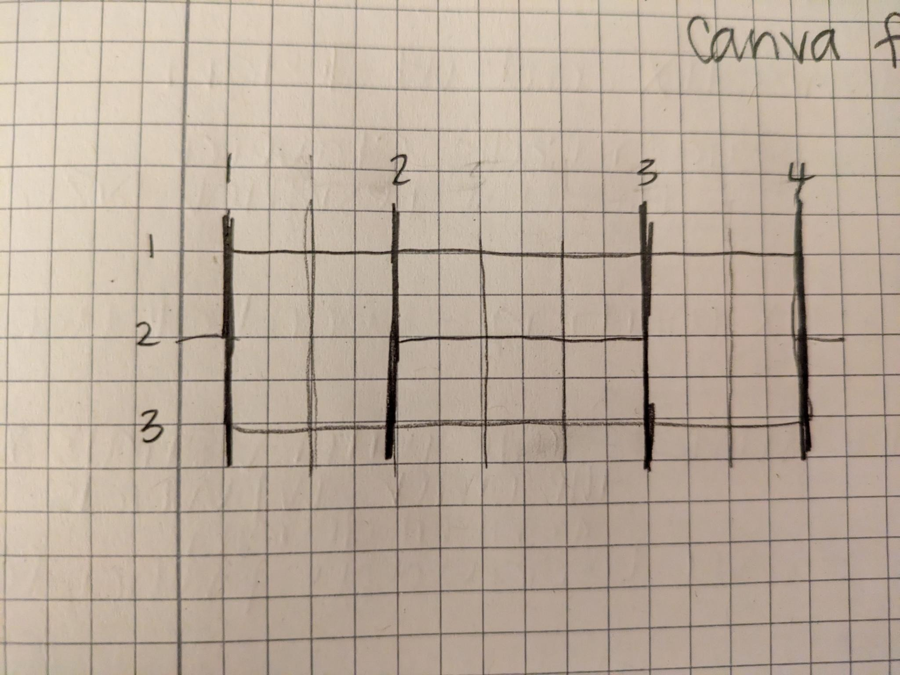
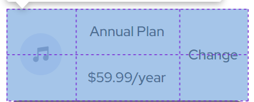

# Frontend Mentor - Order summary card

## 🌍 Overview

This little component is a beginner project from [Frontend Mentor](https://www.frontendmentor.io/challenges/order-summary-component-QlPmajDUj/hub). I wanted to build this project to stay connected to my CSS skills.

As with any skill, if you don't use it, you lose it. 😫 So this little build is a part of my ongoing professional development.

You can see a couple of other little, cutie builds [here](https://github.com/crwainstock/fe-mentor-qr) and [here](https://github.com/crwainstock/fe-mentor-3-column-preview-card) and [here](https://github.com/crwainstock/fe-mentor-single-price-grid).

## 🛠️ Technologies & Dependencies

This component was built with HTML and vanilla CSS. No dependencies! 🥳 I also used [PerfectPixel](https://www.welldonecode.com/perfectpixel/) and the [Eye Dropper/Color Picker](https://eyedropper.org/) browser extensions to help with the build.

I deployed the component with Netlify, though, so check that out [here](https://silly-crostata-2328cf.netlify.app/).

## 🤔 Reflection

So, the last Frontend Mentor component I built involved using grid to arrange the layout. I'm happy to report that in this build, I was able to use grid to format the parts of the component by heart. ❤️ That's right! I looked at the design, drew a little picture of what the grid might look like to implement the layout, and then proceeded to write the CSS to create said layout WITHOUT GOOGLING ANYTHING. It was a phenomenal feeling. 🙂

Overall, I feel like these builds are really useful for reinforcing my understanding and fluency with CSS and HTML.

## 👀 Demo & Live Version

Check out the live version of this component [here](https://silly-crostata-2328cf.netlify.app/).
